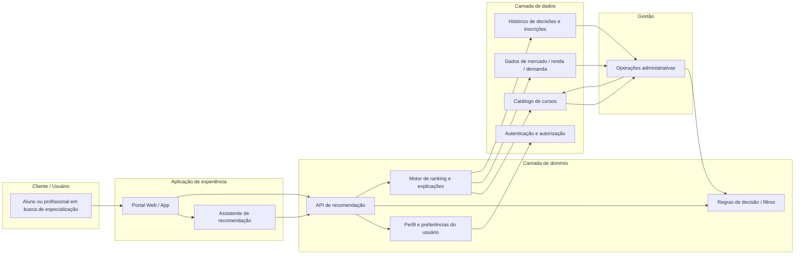
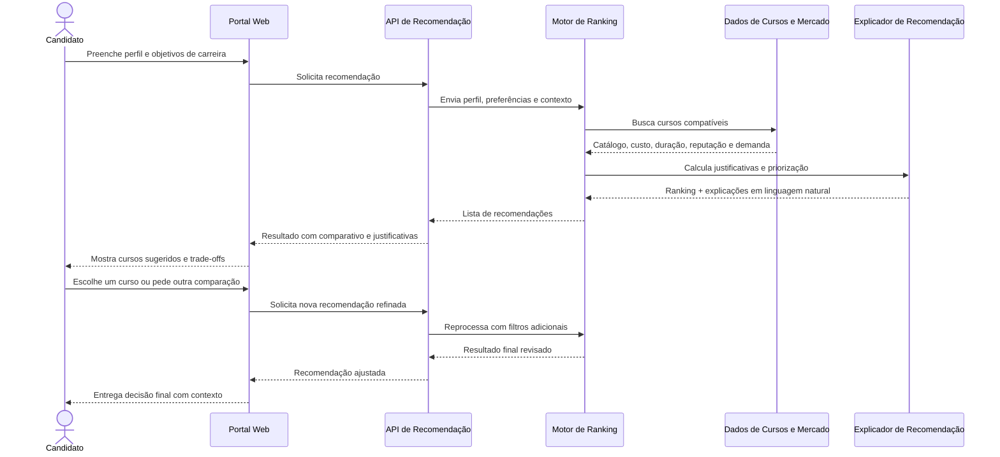
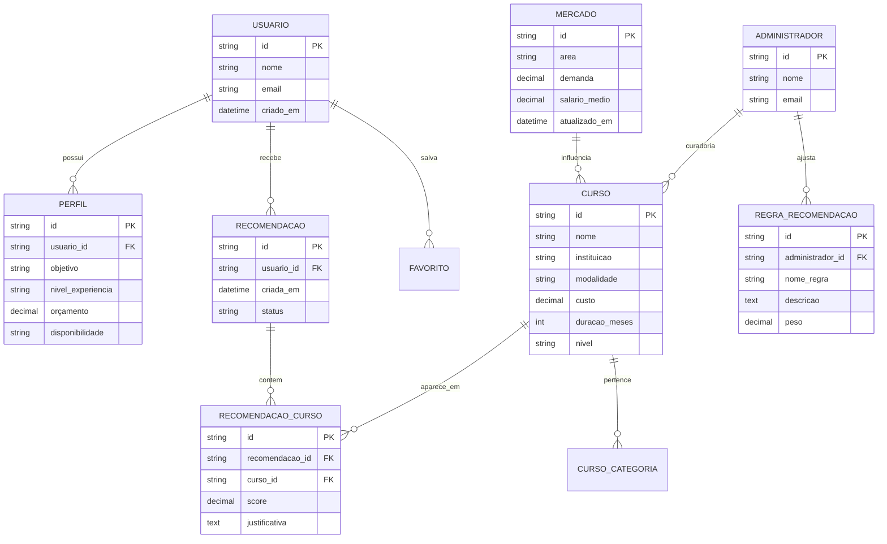

# Sistema de recomendação de cursos de especialização

## 1. Introdução

Este projeto documenta uma proposta de arquitetura para um sistema de recomendação de cursos de especialização orientado ao apoio à decisão do candidato. A solução foi concebida para reduzir a incerteza na escolha de programas de pós-graduação, especialização ou formação contínua, considerando perfil do usuário, objetivos profissionais, orçamento, disponibilidade e contexto de mercado.

A proposta não se configura como uma plataforma completa de ensino, mas como um sistema de apoio à decisão, com foco em recomendação explicável, comparação entre alternativas e redução do risco de desistência ou abandono por escolha inadequada.

## 2. Descrição do sistema

O sistema tem como objetivo recomendar cursos de especialização com base no perfil do usuário e em indicadores de mercado. O candidato informa dados como experiência profissional, objetivos de carreira, disponibilidade, orçamento e nível de interesse. O sistema combina essas informações com um catálogo de cursos e dados de empregabilidade para sugerir alternativas com justificativas e ranking sensível ao contexto.

### 2.1 Escopo

- Cadastro e atualização de perfil do usuário
- Coleta de objetivos de carreira, disponibilidade, orçamento e contexto de decisão
- Sugestão de cursos com ranking e justificativas
- Comparação entre cursos por custo, duração, modalidade, reputação e alinhamento com metas profissionais
- Acompanhamento do processo de decisão e refinamento de recomendações
- Suporte administrativo para curadoria do catálogo e das regras de recomendação

### 2.2 Nível de visão

A visão arquitetural é de um sistema de apoio à decisão orientado por dados e IA, com elementos de negócio, regras e dados estruturados. O objetivo é manter a recomendação útil, transparente e explicável, com apoio humano na decisão final.

### 2.3 Limites e responsabilidades

O sistema deve:

- recomendar cursos com base em regras e dados estruturados
- explicar por que um curso foi sugerido
- indicar trade-offs entre opções
- permitir revisão manual e decisão humana

O sistema não deve:

- substituir a escolha final do estudante
- garantir matrícula, aprovação ou empregabilidade
- assumir responsabilidade legal por decisões educacionais
- funcionar como único critério para formação profissional sem contexto humano

### 2.4 Integrações

- Catálogo de cursos de instituições parceiras
- Base de dados de mercado de trabalho com salário, demanda e competências em alta
- Sistema de autenticação e perfil do usuário
- Painel administrativo para gestão de cursos e regras de recomendação
- Integrações opcionais com e-mail, WhatsApp ou CRM para acompanhamento

### 2.5 Restrições e lacunas

- Não há garantia de atualização em tempo real do mercado de trabalho
- Dados de cursos podem variar em qualidade, formato e consistência entre instituições
- A recomendação deve lidar com dados incompletos do usuário
- Pode haver conflito entre objetivo de carreira e preferência pessoal
- O sistema não resolve automaticamente problemas de acessibilidade, ritmo de estudo e perfil individual de aprendizagem sem dados adicionais

## 3. Visão do sistema em linguagem natural

O sistema funciona como um consultor digital de formação. Um usuário informa seu perfil e seus objetivos. O sistema combina esses dados com um catálogo de cursos, indicadores de mercado e regras de negócio para gerar uma recomendação ordenada por relevância.

A experiência essencial envolve: cadastro do perfil, comparação de opções, explicação dos critérios e refinamento incremental da decisão. Essa abordagem reduz a incerteza e aumenta a confiança do usuário ao escolher um curso.

A arquitetura divide-se em duas camadas principais: uma camada de dados e regras de negócio e uma camada de experiência orientada por IA. A primeira organiza o catálogo, o perfil, o histórico e os indicadores; a segunda interpreta o contexto do usuário e entrega uma recomendação útil e explicável.

## 4. Diagrama estrutural (Mermaid)

Abaixo está uma visão estrutural inspirada em containers, com foco na separação entre a experiência do usuário, o motor de decisão, os dados e a gestão do catálogo.

### Ajustes ao diagrama gerado

- Mantive uma visão simples e adequada ao objetivo de discovery, sem detalhamento excessivo de microserviços.
- Incluí explicitamente a camada de dados de mercado, porque ela é crucial para ponderar custo, retorno e demanda.
- Separei o componente de explicação do componente de API, para deixar claro que a recomendação não é um filtro bruto, mas uma decisão interpretada e explicada.
- Destaquei o papel do administrador no curadoria do catálogo e na evolução das regras de decisão.

## 5. Diagrama comportamental (Mermaid)

A seguir, um diagrama de sequência ilustrando uma jornada crítica: um candidato busca uma recomendação para um curso de especialização com base em objetivos, orçamento e disponibilidade.

### Ajustes ao comportamento

- O fluxo foi desenhado como uma decisão humana e iterativa, não como um processo instantâneo.
- A explicação foi mantida separada do motor de ranking para tornar a recomendação mais transparente.
- O processo demonstra que a recomendação depende de múltiplos dados, e não de um único critério como popularidade ou preço isolado.

## 6. Decisões e ajustes em relação ao modelo gerado

O modelo gerado foi útil para estruturar a base da arquitetura e identificou corretamente elementos centrais como usuário, catálogo de cursos, dados de mercado, API de recomendação e interface de experiência.

No entanto, foi necessário ajustar alguns pontos para aproximar a solução da realidade do uso:

1. A recomendação precisa ser explicável, não apenas classificada. Isso melhora confiança e reduz indecisão.
2. O sistema não é apenas um motor de IA; depende de catalogação, regras e dados estruturados para operar de forma previsível.
3. O papel administrativo é essencial para curadoria do catálogo e ajuste das regras de recomendação.
4. O sistema deve permitir refinamento incremental da decisão, conforme o usuário ajusta objetivos, orçamento e disponibilidade.

## 7. Requisitos funcionais

A arquitetura foi complementada com requisitos funcionais para reduzir ambiguidades e tornar a solução mais implementável.

- RF01: o usuário deve conseguir criar e editar seu perfil profissional e acadêmico.
- RF02: o sistema deve permitir informar objetivos de carreira, disponibilidade e orçamento.
- RF03: o sistema deve consultar o catálogo de cursos e filtrar opções por modalidade, custo, duração e requisitos.
- RF04: o sistema deve gerar uma recomendação ordenada por relevância com base em perfil, objetivos e mercado.
- RF05: cada recomendação deve incluir justificativa em linguagem natural, com trade-offs e explicações de priorização.
- RF06: o usuário deve poder comparar duas ou mais opções lado a lado.
- RF07: o sistema deve permitir refinamento da recomendação após nova entrada do usuário.
- RF08: o sistema deve registrar histórico de recomendações, aceitação e rejeição para melhorar o contexto futuro.
- RF09: um administrador deve conseguir cadastrar, revisar e atualizar cursos e regras de recomendação.
- RF10: o sistema deve indicar claramente quando os dados são incompletos ou quando há baixa confiabilidade na recomendação.

## 8. Requisitos não funcionais

- RNF01: o sistema deve responder às recomendações em tempo útil para UX em web/mobile, preferencialmente em até alguns segundos em cenários típicos.
- RNF02: a arquitetura deve permitir escala horizontal para aumentar volume de usuários, cursos e integrações.
- RNF03: as integrações com dados de mercado devem ser resilientes, com fallback e logs quando uma fonte externa falhar.
- RNF04: os dados pessoais devem ser protegidos por políticas de acesso e armazenamento seguro.
- RNF05: a recomendação deve ser explicável e auditável, permitindo rastrear critérios que influenciaram a priorização.
- RNF06: o sistema deve manter a consistência do catálogo, evitando duplicidade de cursos e inconsistência de registros.
- RNF07: a solução deve ser acessível e seguir critérios básicos de usabilidade para usuários com diferentes perfis e níveis de digitalização.
- RNF08: a manutenção deve ser simples, com separação clara entre regras de negócio, integração de dados e experiência do usuário.

## 9. Segurança, privacidade e conformidade

A arquitetura também precisa tratar requisitos de segurança e privacidade para ser adequada a um sistema realista.

- Autenticação: login com autenticação forte para usuários e administradores.
- Autorização: roles distintas para aluno, administrador, analista e instituição parceira.
- Proteção de dados: uso de criptografia em trânsito e em repouso para dados sensíveis.
- Consentimento: coleta de consentimento explícito para uso e armazenamento de dados pessoais.
- Auditoria: registro de acessos e alterações em regras e catálogos.
- Minimização de dados: armazenar somente o necessário para recomendação e suporte à decisão.
- Retenção: política definida para expurgo de dados não mais necessários.
- Tratamento de vieses: critérios de recomendação devem ser revisados para evitar discriminação ou favorecimento indevido.

## 10. Modelo de dados resumido

A base de dados deve refletir as entidades principais que sustentam a recomendação.

## 11. Riscos e mitigação

- Dados incompletos: usar fallback e classificação de confiança da recomendação.
- Mercado em mudança: atualizar indicadores com frequência e manter histórico de versões.
- Viés de recomendação: revisar pesos e critérios periodicamente.
- Falta de confiança do usuário: priorizar explicações e comparação entre alternativas.
- Problemas de privacidade: aplicar minimização, consentimento e controles de acesso.

## 12. Coerência entre artefatos

A coerência documental foi validada para garantir que cada artefato reforça a mesma visão arquitetural:

- O README descreve escopo, fluxo e diagramas da solução.
- O arquivo AGENTS.md define diretrizes para que agentes de IA respeitem o limite de negócio e não ampliem indevidamente o sistema.
- O documento de arquitetura detalha os blocos funcionais e o fluxo principal, alinhado ao diagrama estrutural do README.
- O documento de requisitos traduz a proposta em funcionalidades e critérios observáveis.
- O documento de segurança reforça as exigências de privacidade, autorização e auditoria que o sistema precisa ter para ser aceitável em uso real.

Assim, a arquitetura permanece consistente entre visão de negócio, requisitos, segurança e implementação futura.

## 13. Estrutura do repositório

Este repositório foi organizado para manter a documentação enxuta, profissional e útil como contexto para agentes de desenvolvimento.

- README.md: visão geral, escopo e diagramas da arquitetura
- AGENTS.md: instruções rápidas para consumo por IA ou agentes
- docs/architecture.md: visão resumida dos componentes e fluxos
- docs/adr-001.md: decisão central de arquitetura sobre explicabilidade da recomendação
- docs/requirements.md: requisitos funcionais e não funcionais
- docs/security.md: segurança, privacidade e governança
- .gitignore: ignora artefatos locais e temporários

## 14. Resumo executivo

Essa documentação propõe uma solução de recomendação de cursos de especialização como um sistema de apoio à decisão, com foco em clareza, explicabilidade e alinhamento entre perfil e objetivo de carreira. O uso de diagramas em Mermaid permite versionar a arquitetura, revisar decisões e fornecer contexto útil para futuras implementações com IA.

Com a adição de requisitos funcionais, critérios de qualidade, segurança e modelo de dados, a arquitetura deixa de ser apenas um desenho conceitual e passa a ser uma base muito mais sólida para uma implementação real e para uso com agentes de desenvolvimento.

A coerência final dos artefatos foi validada: o problema, a arquitetura, os requisitos e a segurança convergem para a mesma proposta e não contradizem o escopo do sistema.
