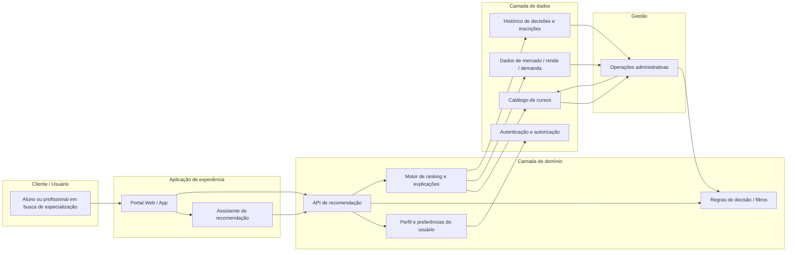
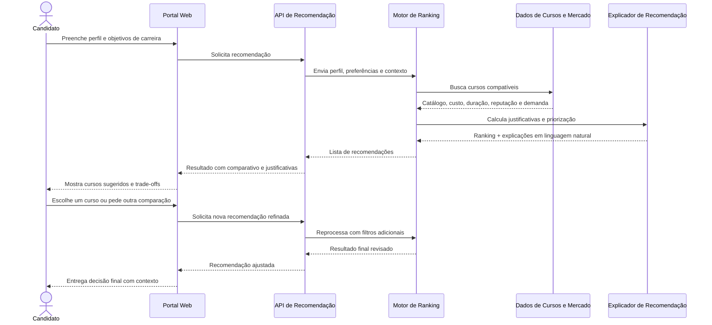

# Sistema de recomendação de cursos de especialização

## 1) Descrição do sistema

Este sistema tem como objetivo apoiar candidatos a cursos de especialização na escolha do melhor programa, com base em perfil, objetivos de carreira, disponibilidade, orçamento e contexto de mercado. A ideia é reduzir a desistência e o abandono por meio de recomendações mais alinhadas ao candidato, evitando que ele escolha um curso por influência superficial, falta de informação ou excesso de opções.

O sistema funciona como um assistente de decisão para estudantes ou profissionais que querem evoluir em carreira, trocar de área ou aprofundar uma especialização sem assumir riscos desnecessários. Ele agrega dados do perfil do usuário, preferências acadêmicas, histórico profissional, metas de carreira, custo e disponibilidade, além de informações sobre cursos disponíveis, avaliações e demanda de mercado.

### Escopo

- Cadastro e atualização de perfil do usuário
- Coleta de objetivos de carreira e grau de urgência
- Sugestão de cursos com ranking e justificativas
- Comparativo entre cursos por custo, duração, carga horária, modalidade e reputação
- Acompanhamento do processo de decisão e inscrição
- Sugestões de próximos passos para quem está indeciso

### Nível da visão

A visão principal é de um sistema de apoio à decisão orientado por dados e IA. Não se trata de uma plataforma de ensino completa, e sim de um mecanismo de recomendação e orientação que pode ser integrado a um portal acadêmico, consultoria de formação ou canal de relacionamento com instituições.

### Limites e responsabilidades

O sistema deve ser responsável por:

- recomendar cursos com base em regras e dados estruturados
- explicar por que um curso foi sugerido
- indicar trade-offs entre opções
- permitir a revisão manual e a decisão humana

O sistema não deve:

- substituir a escolha final do estudante
- garantir matrícula ou aprovação em curso
- assumir responsabilidade legal por decisões educacionais
- atuar como único critério para formação profissional sem contexto humano

### Integrações

- Catálogo de cursos de instituições parceiras
- Base de dados de mercado de trabalho (salário, demanda, competências em alta)
- Sistema de autenticação e perfil do usuário
- Painel administrativo para gestão de cursos e regras de recomendação
- Eventual integração com e-mail, WhatsApp ou CRM para acompanhamento

### Restrições e lacunas

- Não há garantia de atualização em tempo real do mercado de trabalho
- Os dados de cursos podem variar em qualidade e formato entre instituições
- A recomendação precisa lidar com dados incompletos do usuário
- Pode haver conflito entre objetivo de carreira e preferências pessoais (ex.: custo vs prestígio)
- O sistema não resolve problemas de acessibilidade, ritmo de estudo e perfil individual de aprendizagem sem dados adicionais

## 2) Visão do sistema em linguagem natural

O sistema funciona como um “consultor de formação” digital. Um usuário informa seu perfil, os objetivos desejados e o contexto de decisão. O sistema combina isso com dados do catálogo de cursos e indicadores de mercado para gerar recomendações ordenadas por relevância.

A experiência essencial é: a pessoa entra no sistema, responde algumas perguntas, recebe recomendações, compara opções e pode receber orientações em linguagem natural sobre por que um curso é mais adequado para ela. Essa abordagem reduz a incerteza e aumenta a confiança na escolha.

O sistema tem duas camadas principais: uma camada de dados e regras de negócio e uma camada de experiência orientada por IA. A primeira organiza o catálogo, perfil, histórico e métricas; a segunda interpreta o contexto do usuário e entrega uma recomendação útil e explicável.

## 3) Diagrama estrutural (Mermaid)

Abaixo está uma visão estrutural inspirada em containers, com foco na separação entre a experiência do usuário, o motor de decisão, os dados e a gestão do catálogo.

### Ajustes que fiz ao diagrama gerado

- Mantive uma visão simples e adequada ao objetivo de descoberta, em vez de um desenho excessivamente detalhado de microserviços.
- Incluí explicitamente a camada de “dados de mercado”, porque ela é crucial para decidir entre cursos com custo, retorno e demanda diferentes.
- Separei o componente de explicação e ranking do componente de API, para deixar claro que a recomendação não é apenas um filtro bruto, mas uma decisão com interpretação.
- Dei destaque ao papel do administrador, que participa da curadoria do catálogo e da evolução das regras de decisão.

## 4) Diagrama comportamental (Mermaid)

A seguir, um diagrama de sequência ilustrando uma jornada crítica: um candidato busca uma recomendação para um curso de especialização com base em objetivo, orçamento e disponibilidade.

### Ajustes no comportamento

- A sequência foi desenhada para refletir uma decisão humana e iterativa, não um processo instantâneo. O usuário pode refinar escolhas e receber um novo ranking.
- Mantive a camada de explicação separada do motor de ranking, para tornar a recomendação mais transparente e útil para a decisão.
- O fluxo mostra que a recomendação depende de múltiplos dados, e não de um único critério como “curso mais popular”.

## 5) Decisões e ajustes em relação ao modelo gerado

O modelo foi útil para formar a base da arquitetura e identificou corretamente os elementos centrais:

- usuário
- catálogo de cursos
- dados de mercado
- API de recomendação
- interface de experiência

No entanto, precisei ajustar alguns pontos para aproximar a solução da realidade de uso:

1. A recomendação precisa ser explicável, não apenas “classificada”. Essa é uma exigência importante para ganhar confiança do usuário.
2. O sistema não é apenas um motor de IA; precisa de catalogação, regras e dados estruturados para funcionar de forma previsível.
3. A presença de um papel administrativo foi importante, porque não é qualquer pessoa que deve decidir sobre cursos permitidos ou regras de recomendação.
4. O sistema deve permitir refinamento incremental: o usuário pode mudar objetivo, orçamento, disponibilidade ou foco profissional e receber uma nova recomendação.

## 6) O que faltaria para um agente construir o sistema sem inventar decisões

Para que um agente de desenvolvimento implementasse o sistema com aderência à arquitetura documentada, faltariam alguns pontos importantes:

- definição do público alvo: estudantes de pós-graduação, profissionais em transição ou candidatos em geral
- regras de priorização: quais critérios pesam mais (preço, objetivo de carreira, reputação, tempo de conclusão, disciplina etc.)
- modelo de dados do usuário e do curso
- critérios de atualização do catálogo e do mercado
- regras de privacidade, consentimento e armazenamento de dados sensíveis
- requisitos de autenticação, autorização e roles administrativas
- definição da experiência de IA: recomendações com justificativa, comparação de alternativas ou conversas guiadas
- arquitetura de integração com fontes de dados externas e indicadores de mercado
- critérios de usabilidade para acessibilidade e suporte à decisão

## 7) Resumo executivo

Essa documentação propõe uma solução de recomendação de cursos de especialização como um sistema de apoio à decisão, com foco em clareza, explicabilidade e alinhamento entre perfil e objetivo de carreira. O uso de diagramas em Mermaid permite versionar a arquitetura, revisar decisões e fornecer contexto útil para futuras implementações com IA.

Este tipo de documentação é especialmente valioso para a construção de agentes de desenvolvimento porque reduz ambiguidades e evita que eles inventem regras de negócio que não foram acordadas.
